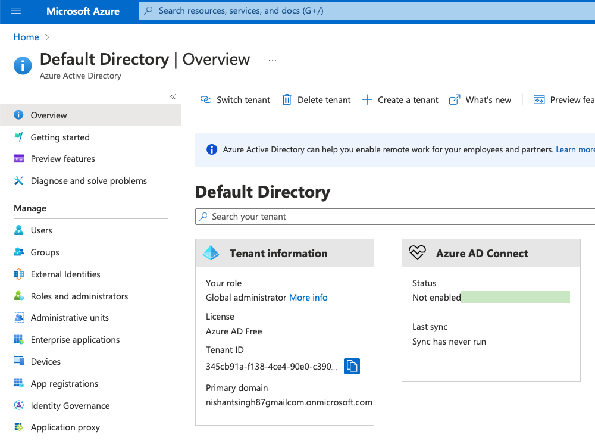

# Tenant

>  **Represents an organization.** Dedicated instance of Azure AD that an organization or app developer **receives at the beginning of a relationship with Microsoft**.
>
>  No need to create one. You already have a default one created when you signup on azure portal.
>
>  ```
>  "Domain": "nishantsingh87gmailcom.onmicrosoft.com",
>  "TenantId": "345cb91a-f138-4ce4-90e0-c3902a912866"
>  ```




<span name=app-reg></span>