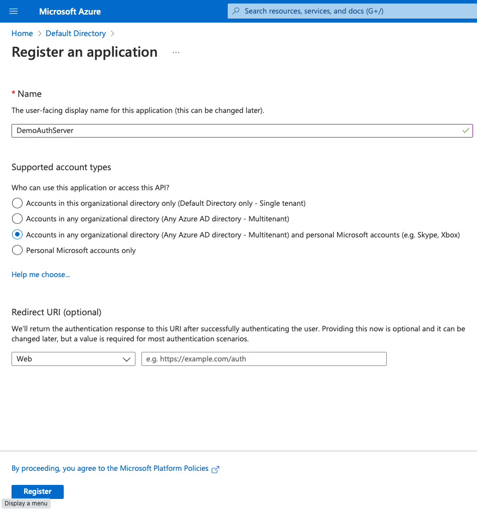
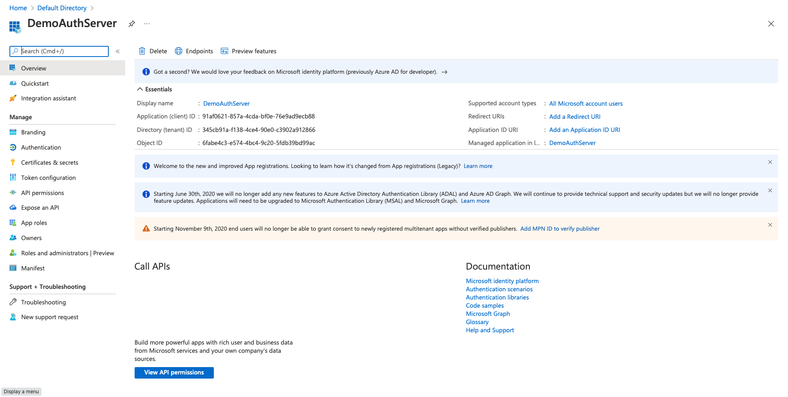

# App registration for Server

- Choose a display name
- Select supported account types (sign-in audience)
  - **Accounts in any organizational directory** [server will only be accessed on behalf of a service and never as end user]
- Redirect uri can be set later (where user is redirected with token after login)
- **Application Id(/client id)** : Generated when registration succeeds

# For to create app registration

# Details for created app registration

