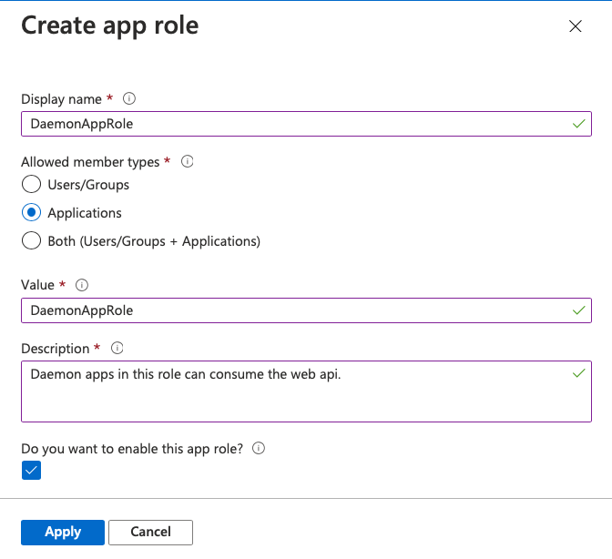
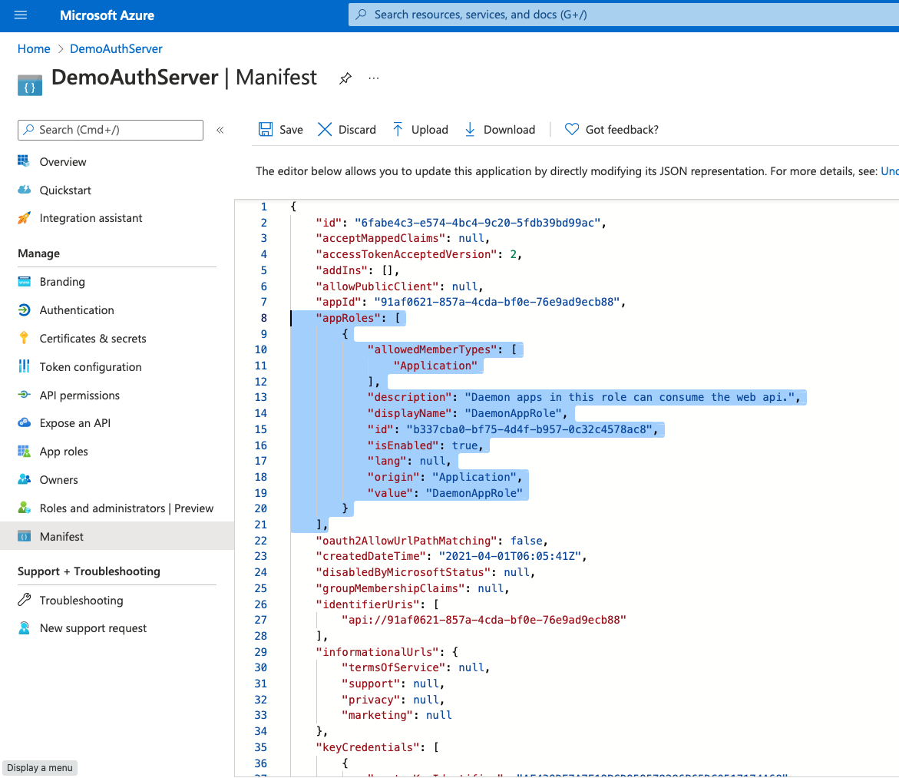

# Create a role for Role Based Access Control (`RBAC`)

- In RBAC, an administrator grants permissions to roles, and not to individual users or groups.  

- You can create roles in either of two ways
  
  - Editing the manifest
- or, Using GUI
  
  

# Using GUI

- Open app registration and go to AppRoles. 

  


# Using Manifest editor

- Open app registration and go to Manifest

- Edit the manifest by locating the `appRoles`.  The role definition is provided in the JSON code block below. Leave the `allowedMemberTypes` to **Application** only. Each role definition in this manifest must have a different valid **Guid** for the "id" property.
  
  - Save the manifest.
  
  The content of `appRoles` should be the following (the `id` can be any unique **Guid**)
  
  ```json
  {
    ...
      "appRoles": [
          {
              "allowedMemberTypes": [
                  "Application"
              ],
              "description": "Daemon apps in this role can consume the web api.",
              "displayName": "DaemonAppRole",
              "id": "7489c77e-0f34-4fe9-bf84-0ce8b74a03c4",
              "isEnabled": true,
              "lang": null,
              "origin": "Application",
              "value": "DaemonAppRole"
          }
      ],
   ...
  }
  ```
  
  
  
  