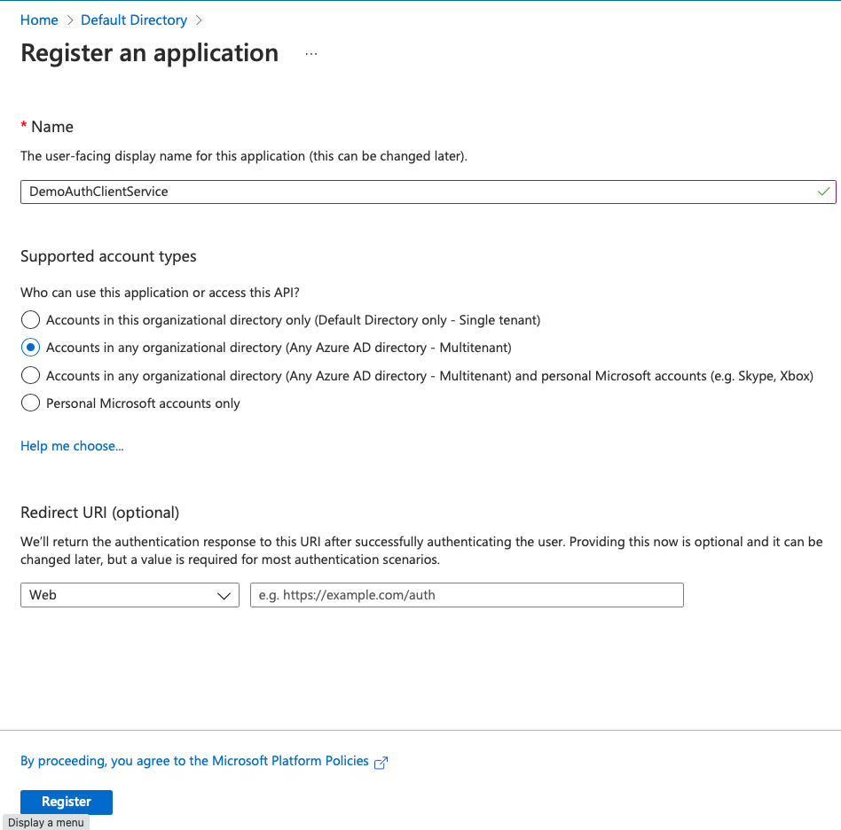

# App registration for Client

- Click `New Rigistration` and create 

  

- Only following two options are allowed for such client apps (i.e. only in Azure AD tenants.)

  - **Accounts in this organizational directory only**. 
  - **Accounts in any organizational directory**. 

  

  

  