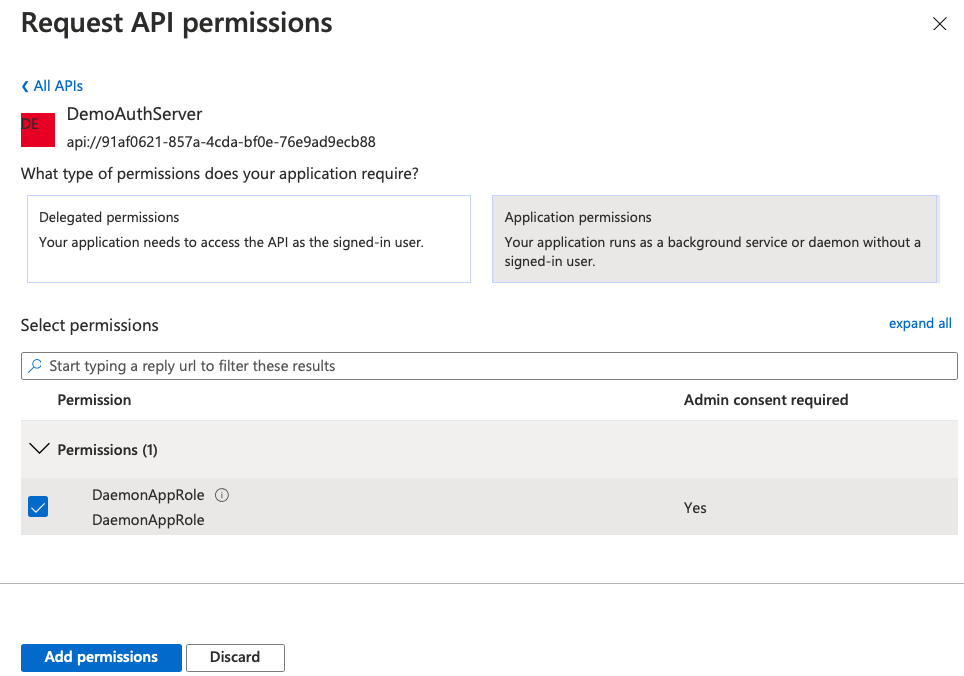
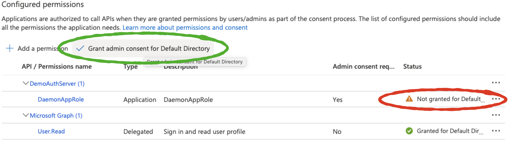

# Add API Permission in Client 

- Open app registration for client and click on `Api Permissions`

- Observe that a ***default permission was assigned alread***

  > Microsoft Graph (1) : User.Read : Sign in and read user profile

- Click the **Add a permission** button and then,
- Ensure that the **My APIs** tab is selected

- Select the API created in the previous step, for example `DemoAuthServer`

- In the **Application permissions** section, ensure that the right permissions are checked: **DaemonAppRole**

- Select the **Add permissions** button

  

- At this stage permissions are assigned correctly but the client app does not allow interaction. 

- Therefore no consent can be presented via a UI and accepted to use the service app. 
  Click the **Grant/revoke admin consent for {tenant}** button, and then select **Yes** when you are asked if you want to grant consent for the requested permissions for all account in the tenant.
  You need to be an Azure AD tenant admin to do this.

  

