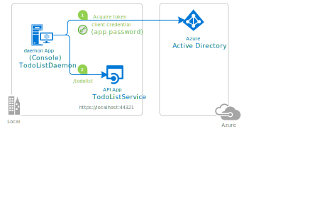

Sources: 

- Code-  https://github.com/Azure-Samples/active-directory-dotnetcore-daemon-v2/tree/master/2-Call-OwnApi
- Doc - https://docs.microsoft.com/en-us/azure/active-directory/develop/scenario-daemon-overview

# Objective

- Setup two services on local machine 
  - **DemoAuthServer**
  - **DemoAuthClientService**
- Configure AAD to implement following workflow to enable authorizatoin and authentication in **DemoAuthServer**

### Summary

- ***[Choose a Tenant](00-tenant-info.md)***

  > We use the default organization for user account
  >
  > **Domain**: "nishantsingh87gmailcom.onmicrosoft.com",
  > **TenantId**: "345cb91a-f138-4ce4-90e0-c3902a912866"

- ***[App registration for server](01-create-app-reg.md)***

  > Define identity of a service/app and get created client-id (aka application-id)
  >
  > **Application (client) ID :** 91af0621-857a-4cda-bf0e-76e9ad9ecb88
  >
  > **Directory (tenant) ID**: 345cb91a-f138-4ce4-90e0-c3902a912866
  >
  > **Object ID** :6fabe4c3-e574-4bc4-9c20-5fdb39bd99ac

- [***Create a role for server to use for Role Based Access Control (RBAC)***](./02-create-server-role.md)

  > Create a role that can be accesses by applicatoin only (we won't use user roles for now).
  >
  > We will assign access control to roles and then assign these roles to individual services.
  >
  > **allowedMemberTypes** : ["Application"]
  >
  > **description** : "Daemon apps in this role can consume the web api."
  > **displayName** : "DaemonAppRole"
  >
  > **origin**: "Application"
  >
  > **value**: "DaemonAppRole"

- ***[App registration for client](03-create-app-reg-client.md)***

  > **Display name**:DemoAuthClientService
  >
  > **Application (client) ID:** a4d814ba-6d10-4b3e-97cc-95ec47d62f3f
  >
  > **Directory (tenant) ID:** 345cb91a-f138-4ce4-90e0-c3902a912866
  >
  > **Object ID:** 9ad88898-3dcb-4f09-88a9-0217d168d93e

- [***Setup Api Permissions in client***](./04-setup-api-permission-in-client.md)

  > This allows client to request for Oauth token with role created earlier.
  >
  > After adding permission to DemoAuthServer role created earlier, click on Grant admin consent.
  >
  > The Azure admin has to explicitly approve this permission. i.e. app can only request a permission in outh token if admin has consented for it.
  
- ***[Add configuration in code for server](05-update-config-for-server.md)*** 

  > Update app settings with azure config 
  >
  > **Instance**: "https://login.microsoftonline.com/",
  >
  > **ClientId**: "91af0621-857a-4cda-bf0e-76e9ad9ecb88",
  > **Domain**: "nishantsingh87gmailcom.onmicrosoft.com",
  > **TenantId**: "345cb91a-f138-4ce4-90e0-c3902a912866"

